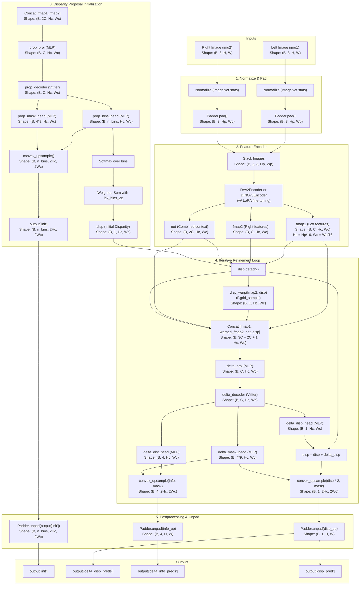

# WAFT-Stereo Dataflow Analysis

This document details the step-by-step dataflow of the **WAFT-Stereo** model, showcasing how inputs flow through preprocessing, feature encoding, proposal initialization, warping, iterative refinement, and final upsampling/unpadding operations.

---

## 📊 Overview Dataflow Diagram

The diagram below maps out the main stages of tensor shapes and functions as they transition from raw stereo input images to the final sub-pixel disparity maps.

---

## 🧬 Key Data Operations Explained

### 1. Coordinate Grids and Warping (`disp_warp`)
Located in [model/utils.py](file:///C:/Users/tlamn/Documents/AI/WAFT-Stereo/model/utils.py#L62-L69), the warping shifts pixels in the right feature map `fmap2` using the estimated disparity `disp`.
* **Grid Creation**: A coordinate grid `[x, y]` is generated using `meshgrid()` in the coordinate scale of the feature maps.
* **Disparity Offset**: The estimated disparity map `disp` is concatenated with zeros (representing no vertical translation) to construct the flow vector: `[-disp, 0]`.
* **Sample Grid**: The flow vectors are added to the coordinate grid, normalized to the range `[-1, 1]` via `normalize_coords()`, and sampled via PyTorch's `F.grid_sample()`.

### 2. Convex Upsampling (`convex_upsample`)
Because feature maps and iterative updates occur at a 1/8 resolution scale (relative to the padded image resolution, since features are downsampled by a factor of 16 and upsampled to a 1/8 scale via `UpsampleFeats`), a convex upsampling kernel is used to lift estimated outputs back to a 1/4 resolution scale before unpadding:
* **Mask Generation**: The mask heads output a tensor of size `(B, 4 * 9, H, W)`. The `4` corresponds to a $2 \times 2$ grid of upsampled sub-pixels, and `9` corresponds to a $3 \times 3$ neighborhood of source low-resolution pixels.
* **Weighted Neighborhood Combination**:
  1. The mask is normalized with a Softmax function over the 9 neighbors.
  2. The target feature maps are unfolded using a $3 \times 3$ patch size.
  3. The target sub-pixel value is computed as a weighted sum of the source $3 \times 3$ neighborhood.
  4. Rearranged to output shape `(B, C, 2H, 2W)`.

### 3. Iterative Feedback Loops
During refinement loops, gradients do not flow backwards through disparity updates into previous loops. This is enforced via `disp.detach()`. The network updates the residual (`delta_disp`) in a self-correcting manner based on the misalignment remaining between `fmap1` and the `warped_fmap2`.
